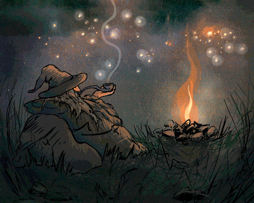
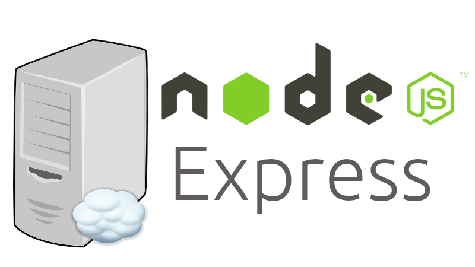

## Hello :wave: Devs, 

  
    
  <samp>
    Hello there! I'm glad to see you right here, nice to meet you! So, my name is Giovani Albuquerque and I realy like to study and build software applications. Nowadays I'm so excited to learn more about Dev Web, Dev Mobile and DevOps because I believe that these three pillars united are very important to understand deepthly the new world of software development we live in.
  </samp>

  

### Programming Languages  :rocket:
| |  | | |
|:---:|:---:|:---:|:---:|

### Frameworks :wrench:
 |  |  |
|:---:|:---:|:---:|

### Connect with me :smiley:

  
  

  

  

